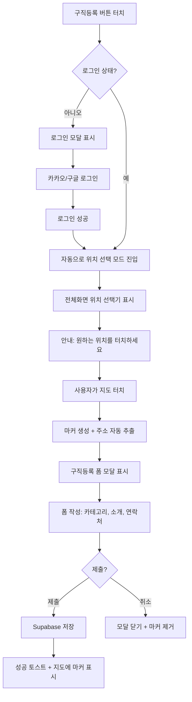
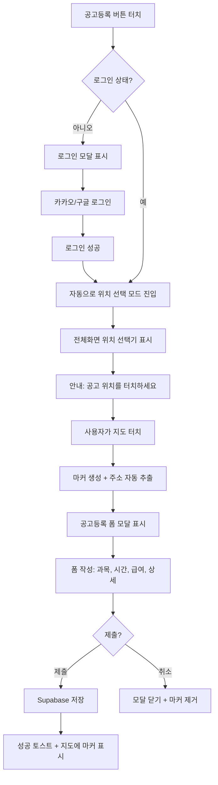
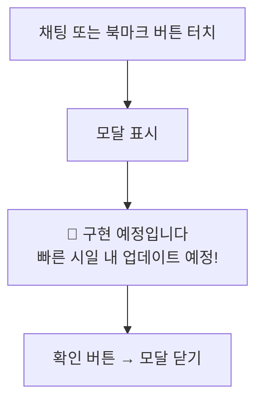

# 모바일 등록 화면 구현 플랜

> 2026-01-29 작성 | 버전 2.0 (피드백 반영)

---

## 현재 상태 분석

### 데스크탑 등록탭 (스크린샷1)


데스크탑에서는 우측에 `LayerToggleBar` 컴포넌트로 구현:
- 로그인/프로필 버튼
- **공고만 보기** 토글 (활성시 공고 마커만 표시)
- **구직자만 보기** 토글 (활성시 구직자 마커만 표시)
- **구직등록** 버튼 → 로그인 체크 → 위치 선택 → 폼 모달
- **공고등록** 버튼 → 로그인 체크 → 위치 선택 → 폼 모달

### 모바일 현재 상태 (스크린샷2)


- 하단에 `MobileBottomSheet` (공고탭): "주변공고 N개 | 더보기"
- `MobileBottomNav`: 현재 작동하지 않는 레거시 코드 ❌

---

## 제안: 새로운 모바일 UI 구조

### ASCII 목업 - 기본 상태

```
┌──────────────────────────────────────────────────────┐
│                                                      │
│                                                      │
│                    [지도 영역]                        │
│                                                      │
│                                                      │
├──────────────────────────────────────────────────────┤  ← 공고탭 (터치시 위로 펼침)
│     📋 주변공고 12개                      더보기 ∧   │
├──────────────────────────────────────────────────────┤  ← 등록탭 네비게이션바 (고정)
│                                                      │
│   📍      👤       💬      ⭐      ➕       📝       │
│  공고    구직자    채팅   북마크   구직     공고      │
│  보기    보기    (예정)  (예정)   등록      등록      │
│                                                      │
└──────────────────────────────────────────────────────┘
           ↑ Safe Area (iOS 대응)
```

### 공고탭 펼침 상태 (더보기 클릭)

```
┌──────────────────────────────────────────────────────┐
│                 [지도 영역] (축소)                    │
├──────────────────────────────────────────────────────┤
│  📋 주변 공고                              접기 ∨    │
├──────────────────────────────────────────────────────┤
│  ┌────────────────────────────────────────────────┐  │
│  │  공고 카드 1                                    │  │
│  │  영어 · 시흥시 · 3시간전                         │  │
│  └────────────────────────────────────────────────┘  │
│  ┌────────────────────────────────────────────────┐  │
│  │  공고 카드 2                                    │  │
│  │  수학 · 분당구 · 1일전                          │  │
│  └────────────────────────────────────────────────┘  │
│                  ... 스크롤 가능 ...                  │
├──────────────────────────────────────────────────────┤  ← 등록탭 (항상 고정!)
│   📍      👤       💬      ⭐      ➕       📝       │
│  공고    구직자    채팅   북마크   구직     공고      │
└──────────────────────────────────────────────────────┘
```

---

## 버튼 6개 상세 정의

| # | 아이콘 | 레이블 | 동작 | 상태 |
|---|--------|--------|------|------|
| 1 | `MapPin` | 공고보기 | 공고 마커만 표시 토글 | 활성시 강조 (bg-gray-200) |
| 2 | `User` | 구직자보기 | 구직자 마커만 표시 토글 | 활성시 강조 (bg-gray-300) |
| 3 | `MessageCircle` | 채팅 | "구현 예정입니다" 모달 | 항상 비활성 스타일 |
| 4 | `Star` | 북마크 | "구현 예정입니다" 모달 | 항상 비활성 스타일 |
| 5 | `Plus` | 구직등록 | 구직자 등록 플로우 시작 | 로그인 필요 |
| 6 | `FileText` | 공고등록 | 공고 등록 플로우 시작 | 로그인 필요 |

### 레이어 토글 로직 (데스크탑 동일)

```
둘 다 OFF → 모든 마커 표시 (기본)
공고보기 ON → 공고 마커만 표시 (구직자 숨김)
구직자보기 ON → 구직자 마커만 표시 (공고 숨김)
둘 다 ON → 모든 마커 표시
```

---

## 사용자 경험 플로우

### Flow 1: 구직등록



### Flow 2: 공고등록



### Flow 3: 채팅/북마크 (미구현)



---

## 등록 모드 UI 상태

### 위치 선택 모드 (FullScreenLocationPicker)

```
┌──────────────────────────────────────────────────────┐
│  ← 취소                              구직등록 모드    │  ← 상단 바
├──────────────────────────────────────────────────────┤
│                                                      │
│                                                      │
│         👆 원하는 위치를 터치하세요                    │
│                                                      │
│                   [지도 전체화면]                     │
│                                                      │
│                                                      │
│                                                      │
│                                                      │
└──────────────────────────────────────────────────────┘
  ※ 등록탭 & 공고탭 숨김
```

### 위치 선택 후 폼 모달

```
┌──────────────────────────────────────────────────────┐
│                                                      │
│  ┌────────────────────────────────────────────────┐  │
│  │           📍 구직등록                           │  │  ← 모달 헤더
│  │    경기도 성남시 분당구 백현동 123              │  │  ← 자동 추출 주소
│  ├────────────────────────────────────────────────┤  │
│  │  카테고리      [초등담임 ▼]                     │  │
│  │  세부과목      [선택 ▼]                         │  │
│  │                                                │  │
│  │  자기소개                                       │  │
│  │  ┌──────────────────────────────────────────┐  │  │
│  │  │                                          │  │  │
│  │  └──────────────────────────────────────────┘  │  │
│  │                                                │  │
│  │  연락처                                        │  │
│  │  ┌──────────────────────────────────────────┐  │  │
│  │  │ 010-0000-0000                            │  │  │
│  │  └──────────────────────────────────────────┘  │  │
│  │                                                │  │
│  │  ┌────────────┐  ┌────────────┐              │  │
│  │  │    취소    │  │    등록    │              │  │
│  │  └────────────┘  └────────────┘              │  │
│  └────────────────────────────────────────────────┘  │
└──────────────────────────────────────────────────────┘
```

---

## Proposed Changes

### 1. [DELETE] `MobileBottomNav.tsx`

기존 레거시 코드 삭제 (5개 버튼 + 작동 안함)

---

### 2. [NEW] `MobileRegisterNav.tsx`

하단 고정 등록탭 네비게이션바

```tsx
interface MobileRegisterNavProps {
  // 레이어 토글
  showJobLayer: boolean;
  showSeekerLayer: boolean;
  onJobLayerToggle: () => void;
  onSeekerLayerToggle: () => void;
  // 등록
  onJobSeekerRegister: () => void;
  onJobPostRegister: () => void;
  // 미구현 기능
  onChatClick: () => void;
  onBookmarkClick: () => void;
  // 로그인 상태
  isLoggedIn: boolean;
}
```

**스타일**:
- 높이: `64px + env(safe-area-inset-bottom)`
- 배경: `rgba(255, 255, 255, 0.95)` + `backdrop-blur`
- 그림자: 상단 방향

---

### 3. [MODIFY] `MobileBottomSheet.tsx`

- `bottom` 값을 `64px + safe-area` 만큼 올림 (네비게이션바 위)

---

### 4. [MODIFY] `Hero.tsx`

- `MobileBottomNav` → `MobileRegisterNav` 교체
- 등록 버튼 핸들러 연결 (pendingAction 로직 재사용)
- 미구현 기능 모달 추가

---

### 5. [NEW] `ComingSoonModal.tsx`

"구현 예정입니다" 간단한 모달 컴포넌트

---

## Verification Plan

### 1. 수동 테스트 (모바일 뷰)

브라우저 개발자 도구에서 모바일 뷰 (375x812) 설정 후:

1. **레이어 토글 테스트**
   - 공고보기 터치 → 지도에 공고 마커만 표시되는지 확인
   - 구직자보기 터치 → 지도에 구직자 마커만 표시되는지 확인
   - 둘 다 OFF → 전체 마커 표시

2. **구직등록 플로우 테스트**
   - 로그아웃 상태에서 구직등록 터치 → 로그인 모달 표시
   - 로그인 후 자동으로 위치 선택기 진입
   - 지도 터치 → 마커 생성 → 폼 모달 표시
   - 폼 작성 후 등록 → 성공 토스트 + 마커 지도에 표시

3. **공고등록 플로우 테스트**
   - 동일한 플로우로 테스트

4. **미구현 기능 테스트**
   - 채팅/북마크 터치 → "구현 예정입니다" 모달 표시

### 2. 레이아웃 테스트

- 공고탭이 네비게이션바 위에 올바르게 위치하는지 확인
- 공고탭 펼침 시 네비게이션바가 가려지지 않는지 확인
- iOS Safe Area가 올바르게 적용되는지 확인

---

> [!IMPORTANT]
> 기존 `MobileBottomNav.tsx`를 완전히 대체합니다.
> 데스크탑과 동일한 등록 플로우(로그인→위치선택→폼→저장)를 모바일에서 구현합니다.
